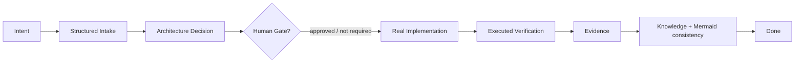

# Agentic Application Template v3.3

Template universal para construir y evolucionar aplicaciones con coding agents sin imponer lenguaje, framework, cloud ni runtime al proyecto. v3.3 añade Project Knowledge progresivo, Mermaid, intake estructurado, clasificación de cambios, gates precisos y Evidence/Done reforzados.

## Idea central

El repositorio **no es la aplicación** y ya no requiere instalar Python para utilizarse. Es el sistema de gobierno y contexto que consume un coding agent compatible.

```text
Usuario
  ↓
Coding Agent (Codex / Claude Code / otro adapter)
  ↓
Agentic Core
  ├─ SPEC
  ├─ Policy
  ├─ Agents
  ├─ Skills
  ├─ Human Gates
  ├─ Evals
  └─ Evidence / State
  ↓
Aplicación real
```

## Inicio rápido

### 1. Crea una carpeta para TU aplicación

```bash
mkdir mi-aplicacion
cd mi-aplicacion
git init
```

### 2. Copia el Core del template al proyecto

Copia `AGENTS.md`, `SPEC.md`, `PROJECT-POLICY.md`, `agents/`, `skills/`, `schemas/`, `evals/` y `.agentic-template/` a la raíz del nuevo repositorio, o crea el repo directamente desde este template de GitHub.

### 3. Abre tu coding agent en esa carpeta

Ejemplo conceptual:

```text
codex
```

o:

```text
claude
```

### 4. Da la intención inicial

```text
Quiero construir una aplicación para administrar inventarios. Inicializa este proyecto siguiendo AGENTS.md y el Agentic Core. No elijas arquitectura irreversible sin presentar primero las decisiones que requieran Human Gate.
```

El Project Assistant debe crear **dentro del mismo repo de la aplicación**:

```text
PROJECT-SPEC.md
PROJECT-STATE.md
project/
  requirements/
  architecture/
  decisions/
  evidence/
```

Después de resolver requisitos y gates, el coding agent crea el código real de la aplicación en ese repositorio.

## Greenfield

La intención puede comenzar con una sola frase. El agente descubre requisitos, restricciones y criterios de aceptación; propone arquitectura sólo cuando existe contexto suficiente; pide aprobación únicamente en Human Gates; implementa, prueba, revisa y registra evidencia.

## Brownfield

Abre el coding agent en el repositorio existente y solicita:

```text
Inicializa el gobierno agentic para este proyecto existente. Audita primero el repositorio, crea baseline y characterization tests cuando sean necesarios. No reemplaces arquitectura existente sin Human Gate.
```

## Qué NO hace el Core

- No presupone Python, Node, Java, .NET, React ni otro stack.
- No crea una aplicación ficticia sólo por registrar una intención.
- No declara una tarea terminada sin evidencia.
- No permite que un adapter amplíe permisos.
- No convierte ejemplos en dependencias del Core.

## Adapters

`adapters/` contiene contratos de integración para distintos coding agents. Un adapter traduce el Core al mecanismo nativo del agente, pero **no redefine Policy ni reglas universales**.

## Runtime opcional

Un runtime determinista podrá existir en `runtime/` cuando necesitemos enforcement que el coding agent no pueda garantizar por sí solo. Debe ser opcional y no convertir su lenguaje de implementación en requisito de las aplicaciones generadas.

El prototipo Python de v3.1 se conserva únicamente en `prototypes/python-harness-v3.1/` como referencia histórica y ya no forma parte del flujo de instalación.

## Project Knowledge (v3.3)

Las aplicaciones derivadas mantienen conocimiento útil junto al código: propósito, actores, requisitos, casos de uso, reglas funcionales, glosario, arquitectura/ADRs, operación y diagramas Mermaid cuando aportan comprensión. Ver `docs/knowledge/PROJECT-KNOWLEDGE.md`.



## Definition of states

- **IMPLEMENTED**: existen artefactos reales de implementación.
- **VERIFIED**: se ejecutó la verificación requerida y su resultado quedó registrado.
- **DONE**: Evidence suficiente y Project Knowledge impactado evaluado/actualizado.
