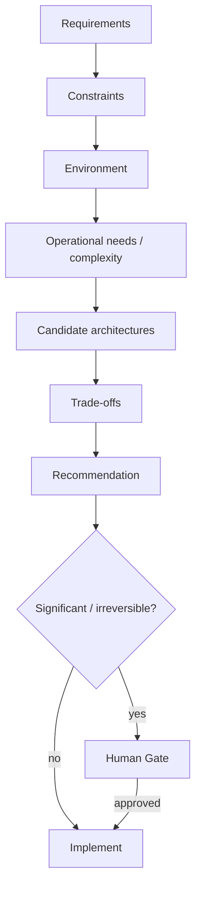

# Architecture Decision Protocol

Architecture is derived from requirements and constraints; it is not a template default.

Distinguish explicitly: **Requirement != Constraint != Preference != Assumption**.

A recommendation records drivers, alternatives, trade-offs, reversibility and gate status. Approved architecture must not be silently replaced; a material replacement opens a new gate.
