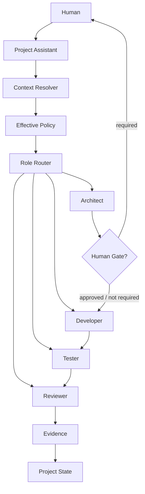

# Core Architecture

```mermaid
flowchart TD
  H[Human] --> PA[Project Assistant]
  PA --> CR[Context Resolver]
  CR --> P[Effective Policy]
  P --> R[Role Router]
  R --> A[Architect]
  R --> D[Developer]
  R --> T[Tester]
  R --> V[Reviewer]
  A --> G{Human Gate?}
  G -->|required| H
  G -->|approved / not required| D
  D --> T --> V --> E[Evidence]
  E --> S[Project State]
```

The Core governs context, authority, workflow, knowledge and evidence. Technology-specific implementation belongs to the project, skills, tools or adapters.
