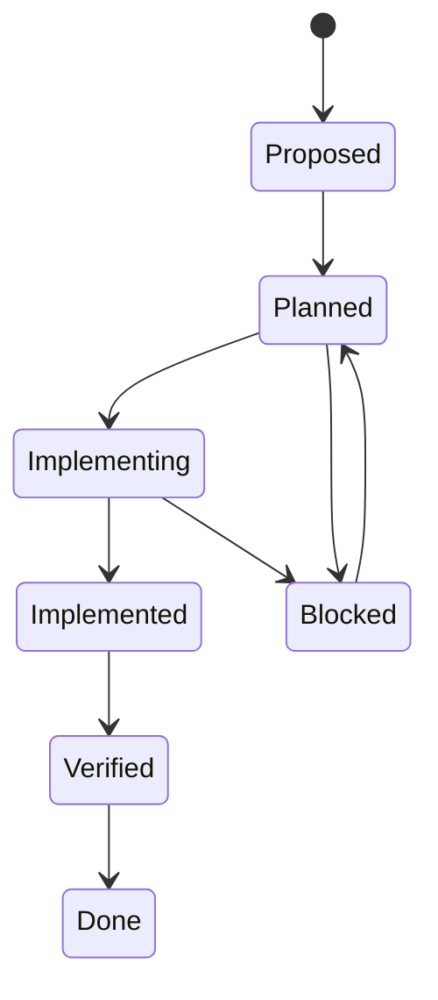

# Work Lifecycle

```mermaid
stateDiagram-v2
  [*] --> Proposed
  Proposed --> Planned
  Planned --> Implementing
  Planned --> Blocked
  Implementing --> Implemented
  Implementing --> Blocked
  Blocked --> Planned
  Implemented --> Verified
  Verified --> Done
```

`Implemented` requires a real artifact. `Verified` requires executed verification. `Done` requires sufficient evidence plus impacted knowledge/documentation updates.
