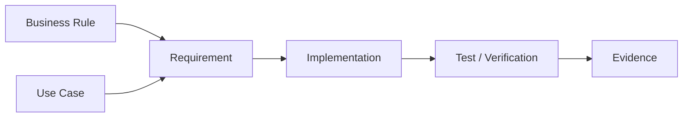
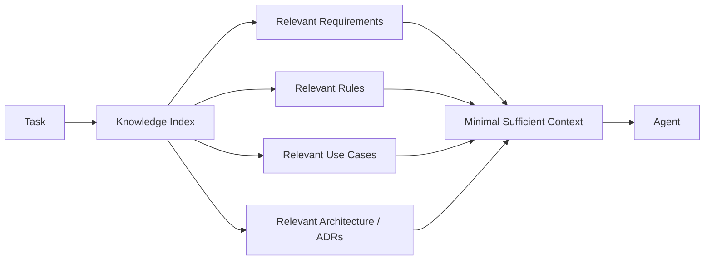

# Project Knowledge Protocol

Project Knowledge is a maintained, progressive knowledge base for humans and agents. Its goal is fast, reliable understanding, not documentation volume.

## Principles

- Overview first, detail on demand.
- Do not duplicate source code in prose.
- Use stable IDs for requirements, use cases and business rules when useful.
- Mermaid diagrams are first-class knowledge and must remain consistent with implementation.
- A behavior-changing task must assess documentation impact before `Done`.
- Small projects may consolidate documents; complex projects may split them by domain.

## Recommended knowledge map

```text
docs/
  README.md
  product/
    overview.md
    actors.md
    use-cases.md
    business-rules.md
    glossary.md
  requirements/
    functional.md
    non-functional.md
  architecture/
    overview.md
    data-model.md
    flows.md
    decisions/
  operations/
    running-locally.md
  security/
    overview.md              # when applicable
  integrations/
    catalog.md               # when applicable
```

## Diagram policy

- Architecture: required for non-trivial applications.
- Data model: required when a meaningful persistent model exists.
- Critical flow/sequence: required when it materially improves understanding.
- State diagram: required for meaningful domain lifecycles.
- Integration/deployment: required when multiple external/runtime components make topology non-obvious.

## Traceability



## Progressive context


