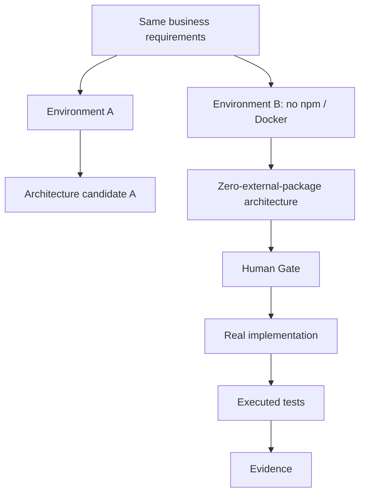

# Inventory E2E — lessons, not a Core dependency

This example records reusable lessons from an E2E validation. It is not an application dependency and must not inject inventory concepts into Core rules.

## Lessons

1. Initial business requirements alone did not determine technology.
2. Environment constraints (`npm` and Docker unavailable) materially changed the valid architecture.
3. Replacing an approved Next.js/PostgreSQL direction with Python standard library/SQLite correctly required a new architecture gate.
4. A visual dashboard redesign was a UI change, not an architecture gate.
5. Executed tests supplied Evidence; unexecuted verification must remain pending.
6. Product/business/architecture knowledge and Mermaid diagrams would have reduced context-recovery cost for later agents.

