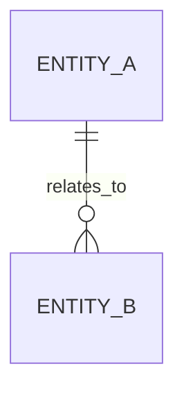

# Data Model

If the application has a meaningful persistent domain model, replace this example with the real model and keep it synchronized.

Document only important entities, relationships, invariants, and portability constraints.
