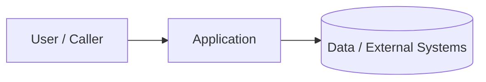

# Architecture Overview

Explain the architecture at a level useful to a new maintainer.

```mermaid
flowchart LR
  U[User / Caller] --> A[Application]
  A --> D[(Data / External Systems)]
```

Replace this placeholder with the real architecture once decided.
